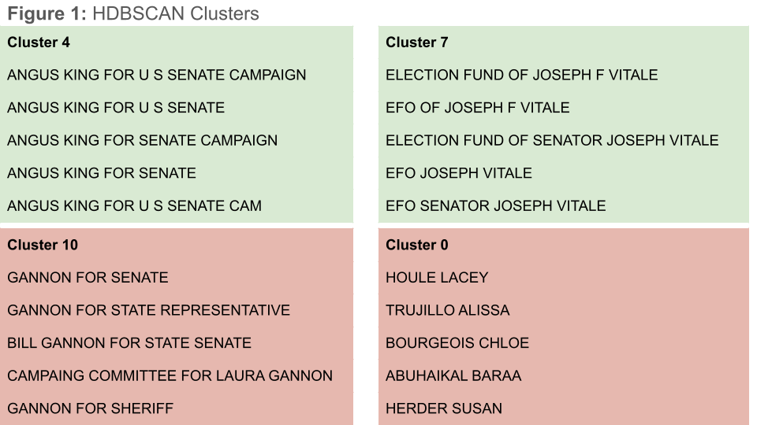
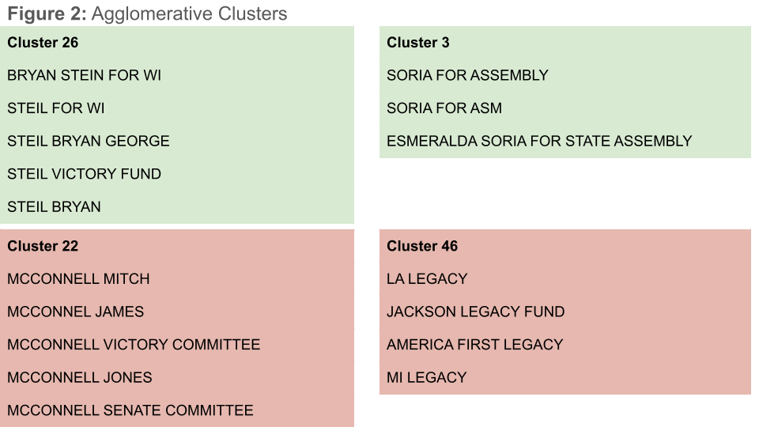
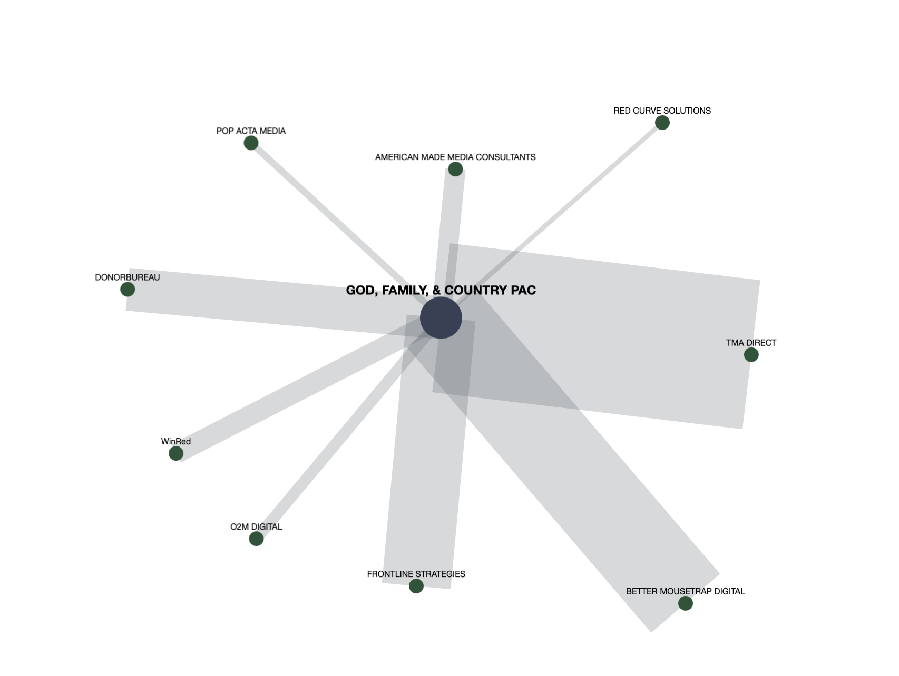
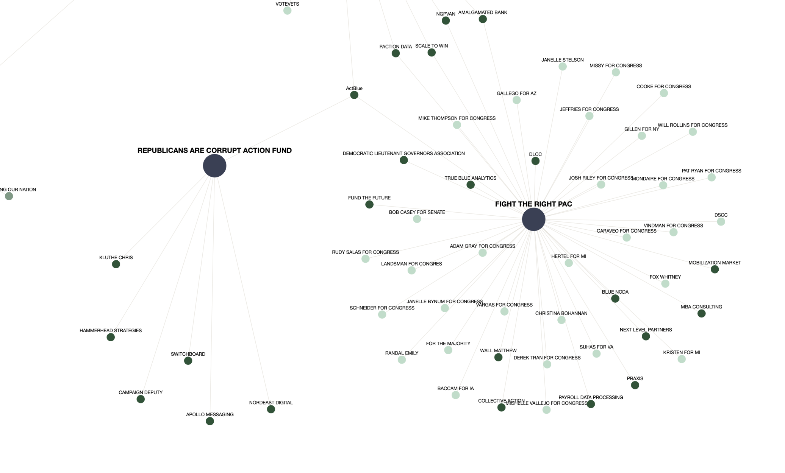

# Summary

Compiling and visualizing federal PAC spending data using network analysis techniques is a step towards programmatically identifying Scam PACs in the federal campaign finance ecosystem. While not predictive, this work has the potential to make naming and shaming bad actors in the federal campaign finance ecosystem less resource intensive on the part of regulators, journalists, and activists. 

# Research Objective

The goal of this project was to provide journalists, researchers, and activists a tool that they could use to explore PAC spending patterns with the aim of identifying potential Scam PACs. 

During the 2023-2024 election cycle, Scam PACs garnered increasing press attention including from Bulwark (Stein, 2024), OpenSecrets (Cook, 2023), and Campaign Legal Center (Wieand, 2024). In December 2023, Representative Katie Porter (D-CA-47) proposed a bill to regulate Scam PACs (SCAM PAC Act, 2023). However, this is not a new phenomenon. The Federal Election Commission (FEC) released a memo detailing the problem and suggesting solutions in 2016 (Federal Election Commission, 2016), and again in 2021 (Federal Election Commission, 2021). More recently, Adam Bonica, has reported on a specific network of what he calls “spam PACs” and their negative impact on political organizing (Bonica, 2025).

For this project, I chose to use the definition of Scam PACs from the proposed 2023 legislation to guide my work.

> [U]nauthorized committees that mislead contributors by “[soliciting] contributions with the promise of supporting candidates, but then disclose minimal or no candidate support activities while engaging in significant and continuous fundraising. This fundraising predominantly funds personal compensation for the committees’ organizers. In many cases, all funds raised by this subset of political committees are provided to fundraising vendors, direct mail vendors, and consultants in which the political committees’ officers appear to have financial interests.”

Because data on the people behind PACs and vendors is not readily accessible, this project is meant to help interested parties identify PACs that warrant deeper investigation based on their spending patterns, rather than labeling PACs as Scam PACs or not. 

# Data Sources

The primary data source for this project was a dataset I constructed that combined the line item spending detail for all PACs, excluding ActBlue, WinRed and officially designated party committees, during the 2024 federal election cycle. I detail the data pipeline I built in the Implementation Appendix. 

This dataset contained information from both schedule B (disbursements) and schedule E (independent expenditure) line items representing all of the money spent by PACs during the course of an election cycle. Ultimately, the dataset contained information on 7,157 PACs and their combined 42,495 filings, with 1,283,302 schedule B and schedule E line items. 

In order to better understand the data I also merged in qualitative information on the filing committees from the FEC's bulk data repository. This additional data allowed me to better label the data, for example, identifying union, trade association, and membership PACs.

Additionally, I merged in summary level financial data for each PAC, also accessible from the FEC. This data includes metrics such as total dollars raised, total dollars raised from unitemized contributions, and total disbursements. This data was used to create filters in my dashboard, and to calculate the percent of a PAC’s total spending that went to a given vendor, which I used for the edge weights in my network visualization. 

The primary features used in this work included the qualitative information on the individual, candidates, committees, or organizations that received money from a PAC, the stated purpose for the expenditure and the amount of the expenditure. For example, paying American Airlines $300 for airfare, or XYZ Lawfirm $1,500 for legal fees. 

The principal challenge with this data is the lack of data validation conducted in the process of submitting filings with the FEC. This results in a dataset composed of messy strings. For example, *'LORI CHAVEZ DEREMER FOR CONGR','LORI CHAVEZ DEREMER FOR CONGRE','LORI CHAVEZ DEREMER FOR CONGRESS'* all indicate a contribution from a PAC to Lori Chavez Dremerer for Congress. This messy string data can complicate analyses by distorting aggregations, relationships or similarities between PACs, and visualizations.

# Techniques Applied 

I focussed on two techniques in this project to help achieve my goal: text mining and network analysis.

## Text Mining
As discussed above, the lack of data validation during the FEC filing process creates a dataset that is unnecessarily noisy. Since the ultimate aim of this project was to generate a network visualization showing the relationships between PACs and their vendors, I knew I would need to clean up the messy string data on vendors in the FEC filings. My goal was to use clustering algorithms discussed in class to attempt to group similar strings in the hopes of reducing the dimensionality of this data.  

I tried two clustering algorithms HDBScan and Agglomerative Clustering from scikit-learn. I chose HDBSCAN because I didn't want to pre-define the number of clusters, and the `max_cluster_size` parameter was a helpful tool for this work. I would not expect many clusters to have more than five values, because we are mostly looking to do text cleaning. 

As shown in Figure 1, some of the clusters look great (green), some are complicated (red) by candidates with similar names running in different states or candidate names and staff or consultant names being similar, others are way off. Additionally, since naming conventions for campaigns and committee names are so ubiquitous, like Citizens For, Committee to Elect, Friends of, during my exploration of clustering methodologies, I found many unrelated campaigns get added together.

I also tried hierarchical clustering using sci-kit learn’s Agglomerative Clustering. I thought that this methodology would be well suited to string cleaning because it would try to group strings by looking at the impact of changing one additional letter on the clusters and choosing the level that gets you closest to what you want. This methodology ran into the same challenges as HDBSCAN, though, while the HDBScan clusters were mostly consistent sizes, with five items, the hierarchical clusters varied in length, which in some cases resulted in more accurate clusters.

Because this work is accusatory in nature – searching for bad actors – I was highly averse to misattributing expenditures that could lead users to investigate PACs for fraudulent behavior. Therefore, in the push and pull between wanting to reduce the noise in the dataset and wanting to present accurate information, I prioritized presenting accurate information. This meant that I decided to not use these text clustering algorithms, instead favoring the rapidfuzz package and manual regex text cleaning. 

Instead of using clustering algorithms, I manually cleaned vendors using regular expression statements and dictionary mapping. This had the added benefit of allowing me to group together related brands, like hotel chains owned by a conglomerate, or various state and local union affiliates. 

I also took advantage of *rapidfuzz* a package built for fuzzy matching strings and applied this tool to group like terms. To do this, I used the `token_sort_ratio` metric, which sorts the words in a string before calculating the normalized indel similarity between two strings. Here too, however, I applied a very high matching threshold in order to avoid attributing spending to the wrong vendors. 

Ultimately, I was only able to reduce the dimensionality of "payees" by around 10% given my high matching threshold.

For future work on this project, I was inspired by some of my classmates work and I plan to experiment with calculating silhouette scores for the clusters generated by the classic clustering models and seeing if there is a reliable threshold there that I can use to say - if the silhouette score for a cluster is above X then group those terms together, otherwise ignore the clustering. 

## Network analysis 
The network analysis piece of this project was my primary focus. Because of the relational nature of Scam PACs, defined by money moving between entities owned or operated by the same people, I felt it would be most impactful to visualize the data as a network. 
A network visualization has the ability to illustrate how closely related two nodes, in this case PACs, are. In the context of investigating Scam PACs that can be important in two opposing ways. On the one hand, if a PAC employs the same vendors as many other PACs, that could signify that they are acting like any other PAC, while if they have their own unique network of spending it could indicate that the PACs are being used to funnel money to vendors that primarily benefit individuals associated with the PAC. On the other hand, if there are clusters of PACs that all share the exact same network of vendors it could indicate that there is a group of multiple PACs all working together to enrich certain vendors. 

# Findings

I was able to generate an interactive dashboard that visualizes PAC spending in a network layout. This dashboard allows viewers to explore patterns in PAC spending from the 2024 election cycle with the aim of identifying abnormal spending patterns that could suggest fraudulent behavior. Due to resource constraints, I was only able to visualize ~ 120 PACs, but still, I was able to identify potential Scam PACs. 

For example, God, Family, & Country PAC, an unqualified PAC that originally registered with the FEC in August 2023, raised $414K in the 2024 election cycle, 86.0% from small-dollar donors. From the network visualization, pictured below, we can see that their spending is primarily to direct mail, and other fundraising vendors, and that they did not directly contribute to any candidate or committee in the course of the 2024 election cycle. This PAC would be a good candidate for a journalist or activist to investigate further to see in the people behind the PAC are also beneficiaries of any of the vendors in their filings. 

Two more examples, Republicans are Corrupt Action Fund and Fight the Right PAC are illustrative. Republicans are Corrupt originally filed with the FEC in August 2024, and are no longer active. Over the course of the 2024 election cycle the PAC raised $117K, 79.2% from small-dollar donors. As you can see below, all of their spending was to fundraising entities and consultants. In contrast, Fight the Right PAC, originally established in April 2021, raised $598K in the 2024 election cycle, 63.5% from small-dollar donors, and did contribute directly to candidates. Were I a journalist, I’d choose to dig deeper into Republicans are Corrupt than Fight the Right.

Importantly, because this tool does not have data on the individuals behind PACs and vendors, it serves only as one step in the process of identifying Scam PACs–helping investigators better direct their efforts rather than directly labeling a PAC as a Scam PAC or not. While there is still work to be done to improve this tool, it is a powerful first step into increasing visibility into the behaviors of federal PACs. By compiling and visualizing PAC spending data in this way, journalists, activists, and regulators can more efficiently explore patterns in PAC spending with the aim of finding and curtailing bad actors. 

Beyond being a tool to identify potential Scam PACs, the network analysis presented here could also be used by researchers to better understand power players in U.S. campaigns. For example, we know that ActBlue and WinRed are the primary online fundraising tools used by Democrats and Republicans respectively. Their market shares give both companies a lot of influence over the campaigns and committees that use their tools, and help shape political fundraising more broadly. ActBlue and WinRed are both two sided market places serving both campaigns and committees and donors, as such they are very visible to the public. Other similarly situated vendors may be less visible, but equally influential in U.S. campaigning. 

Future work on this project includes improving the text cleaning and categorization work and finding a way to efficiently and effectively include all PACs in the visualization together. In addition to experimenting with using silouhette scores as a threshold for text cleaning through clustering, I'd like to expand this work to better categorize spending beyond contributions to candidates and committees and other. For example, categorizing expenses as related to fundraising, travel, or direct mail.  



# Implementation Appendix

Gathering line item details from FEC filings for numerous committees is challenging because of the way data is collected and stored by the FEC. In the context of political action committees, each PAC is required to file detailed reports on how they received money and where they spent money. Different types of receipts and expenditures require the disclosure of different pieces of information and are thus collected and stored differently. These receipt and expenditure types are defined by specific form types. For example SB21 form types are operating expenditures while SB23 are contributions to candidates or committees. Each form type has a different data structure, yet they are all saved together in one custom *.FEC* file format. 

Moreover, each PAC will file multiple financial filings with the FEC through the course of the election cycle, and they are able to amend their reports at any time, meaning you need to be careful to only access the most recent version of any given filings. Say a PAC files monthly with the FEC, if they do not have any amendments they should have 24 individual filings stored with the FEC for a single election cycle. Multiply that by thousands of registered PACs and you have tens if not hundreds of thousands of individual filings that you need to access to have a complete picture of PAC behavior in the federal campaign finance space.

In order to construct my data set I made use of the OpenFEC API’s filings endpoint and the Washington Post’s *FastFEC* tool to download and parse all PAC filings from the 2024 election cycle. This work was originally done for my Data Science II final project and is a lightweight version of an FEC database I helped architect for a former employer. The steps of the process are outlined below. 

1. Use OpenFEC API filings endpoint to identify filing IDs for all PAC filings in the 2024 election cycle 
2. Feed the filing IDs identified in step one through the Washington Post’s *FastFEC* tool to download the actual filings and split them into their component parts.
3. Combine all SB and SE line items from each filing into two complete datasets 

I also used the OpenFEC API’s committee totals endpoint to compile each PAC’s financial summary data which I used to help calculate summary metrics used in the filters for the network visualization. 

All of this work is reflected in the following files:

- 01_download_filings.ipynb
- 02_join_filing_data.ipynb
- 03_download_pac_financials.ipynb

And the corresponding datasets generated are: 

- data/raw/SB_dataset.csv
- data/raw/SE_dataset.csv
- data/processed/pac_financials.csv



# Bibliography

Bachmann, M. (2021). rapidfuzz (Version 2.1.1 or later) [Computer software]. https://github.com/maxbachmann/RapidFuzz

Bachmann, M. (2021) Rapidfuzz 3.14.3 Documentation. https://rapidfuzz.github.io/RapidFuzz/index.html

Bonica, A. (2025, August 3). 'The Mothership Vortex: An Investigation Into the Firm at the Heart of the Democratic Spam Machine.' _On Data and Democracy_. https://data4democracy.substack.com/p/the-mothership-vortex-an-investigation

Charming Data. (n.d.). Home [YouTube channel]. YouTube. Retrieved November 2024, from https://www.youtube.com/@CharmingData

Cook, M. (2023, August 18). How 'Scam PACs' line their pockets by deceiving political donors. _OpenSecrets_.         https://www.opensecrets.org/news/2023/08/how-scam-pacs-line-their-pockets-by-deceiving-political-donors/

Durand, Lucas. (2023, November 1-3). Building an Interactive Network Graph to Understand Communities [Conference presentation]. PyData, New York, NY, United States. https://www.youtube.com/watch?v=3LwxyynEUwQ

Federal Election Commission. (n.d.). PAC Summary 2023-2024. https://www.fec.gov/data/browse-data/?tab=bulk-data/2024/webk24.zip.

Federal Election Commission. (n.d.). Campaign Finance Statistics.
	https://www.fec.gov/campaign-finance-data/campaign-finance-statistics/

Federal Election Commission. (n.d). OpenFEC API. https://api.open.fec.gov/developers/#/

Federal Election Commission. (2016, September 16). Memorandum on Proposal to Attack Scam PACs.
	https://www.fec.gov/resources/about-fec/commissioners/weintraub/statements/2016-09_Memo--Scam-PACs.pdf

Federal Election Commission. (2021, March 5). Memorandum on Proposed Commission Actions to Address "Scam PACs".
	https://www.fec.gov/resources/cms-content/documents/mtgdoc-21-23-A1.pdf

Learner, Sam. (2020). _Which 2020 Candidates Shared Donors?_.
   https://donor-overlap.samlearner.com/

Nallan, Kishore. (2023). _Fuzzy string matching in Python (with examples)_. typesense. 
  https://typesense.org/learn/fuzzy-string-matching-python/

SCAM PAC Act, H.R. 6893, 118th Congress (2023).
	https://www.congress.gov/bill/118th-congress/house-bill/6893/text

Stein, S. (2024, October 17). Dem Scam PACs That Harris Criticized Are Booted Off Fundraising Platform. _The Bulwark_. https://www.thebulwark.com/p/actblue-boots-democratic-scam-pacs-harris-criticized

Talbot, R. Roberts, B. Lash, N. (2025, January, 21). 527 Explorer. _ProPublica_.
	https://projects.propublica.org/527-explorer

Washington Post. (n.d.). FastFEC. https://github.com/washingtonpost/FastFEC

Wieand, R. (2024, April 22). CLC Uncovers Two "Scam PACs" Defrauding Donors. _Campaign Legal Center_. https://campaignlegal.org/update/clc-uncovers-two-scam-pacs-defrauding-donors

